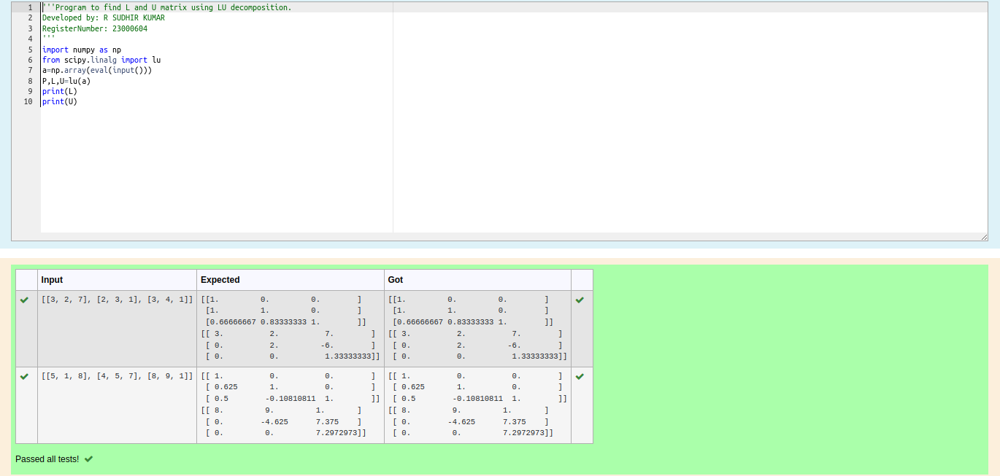
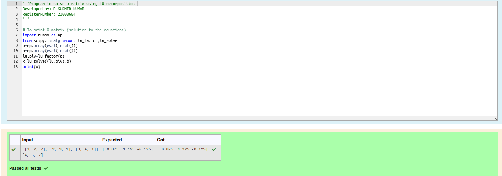

# LU Decomposition 

## AIM:
To write a program to find the LU Decomposition of a matrix.

## Equipments Required:
1. Hardware – PCs
2. Anaconda – Python 3.7 Installation / Moodle-Code Runner

## Algorithm
1. Import the module numpy and scipy to use the build-in functions for calculation 
2. Prepare lists from each linear equations and assign as an array
3. Preform scipy.linalg.lu() to find the pivot table, lower triangle and upper triangle matrix
4. End the program

## Program:
(i) To find the L and U matrix
```python
'''Program to find L and U matrix using LU decomposition.
Developed by: R SUDHIR KUMAR 
RegisterNumber: 23000604
'''
import numpy as np
from scipy.linalg import lu
a=np.array(eval(input()))
P,L,U=lu(a)
print(L)
print(U)

```
(ii) To find the LU Decomposition of a matrix
```python
'''Program to solve a matrix using LU decomposition.
Developed by: R SUDHIR KUMAR
RegisterNumber: 23000604
'''
# To print X matrix (solution to the equations)
import numpy as np
from scipy.linalg import lu_factor,lu_solve
a=np.array(eval(input()))
b=np.array(eval(input()))
lu,piv=lu_factor(a)
x=lu_solve((lu,piv),b)
print(x)
```

## Output:
(i) To find the L and U matrix


(ii) To find the LU Decomposition of a matrix


## Result:
Thus the program to find the LU Decomposition of a matrix is written and verified using python programming.

